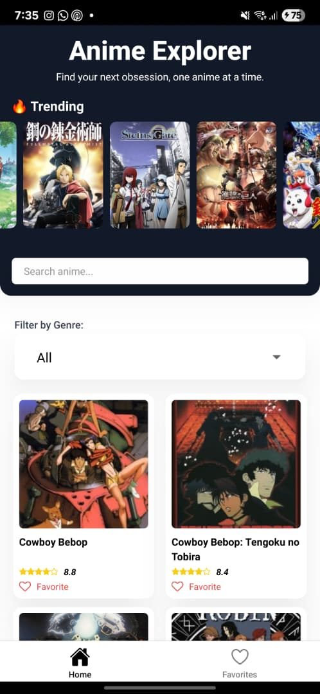
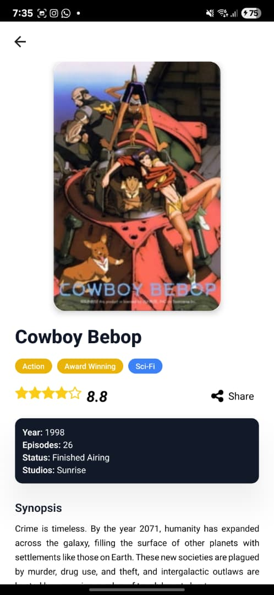
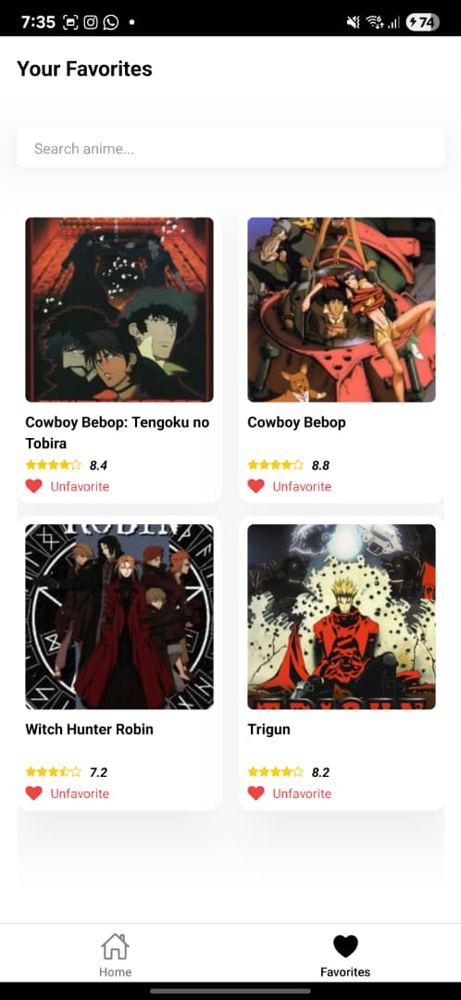

# 📺 Anime Explorer

A simple yet powerful Anime discovery app built using **React Native + TypeScript**, powered by the [Jikan API](https://api.jikan.moe/v4/anime). Users can browse, search, filter by genre, view anime details, and favorite their top picks — all wrapped in a sleek, animated UI with persistent local storage.

---

## ✨ Features

- 📜 Anime list with infinite scroll
- 🔍 Search with debounce logic and reset handling
- 🧾 Detail view with synopsis, genres, and score
- ❤️ Add/remove favorites (with animated heart)
- 📁 Favorites tab with local persistence (AsyncStorage)
- 🎭 Genre filter dropdown
- 🔁 Placeholder UI and shimmer on load
- 🌈 Clean UI with Tailwind (NativeWind)
- 🚀 Performance-optimized components (`React.memo`)
- 📸 Trending banner and image fallback
- 📲 Deep linking and share intent

---

## 📸 Screenshots

| Home                      | Detail                      | Favourite                      |
| ------------------------- | --------------------------- | ------------------------------ |
|  |  |  |

---

## 🧠 Thought Process & Architecture Decisions

- **State Management:** Zustand for lightweight, scalable global state
- **Navigation:** React Navigation for smooth screen transitions
- **API:** Axios + Jikan API with pagination and search
- **Persistence:** AsyncStorage to store favorites across sessions
- **Styling:** NativeWind (Tailwind CSS for React Native)
- **Performance:** Memoized components, shimmer placeholders, image fallbacks
- **Animations:** Favoriting animation via React Native's `Animated` API

---

## 🛠 Tech Stack

- React Native (Expo)
- TypeScript
- Zustand
- React Navigation
- Axios
- AsyncStorage
- Tailwind CSS (via NativeWind)
- Jikan API

---

## 🚀 Getting Started

1. **Clone the repo**

   ```bash
   git clone https://github.com/SedAqeh/AnimeExplorer_SyedFaqihHassan.git
   ```

2. **Install dependencies**

   ```bash
   npm install
   ```

3. **Run the app**

   ```bash
   npx expo start
   ```

> ⚠️ For deep linking support:

```bash
npx expo start --scheme animeexplorer
```

---

## 📦 Folder Structure

```
.
├── src/
│   ├── api/              # Jikan API wrappers
│   ├── assets/           # App icons and splash assets
│   ├── components/       # Reusable UI components
│   ├── navigation/       # App navigation config
│   ├── screens/          # Home, Detail, Favorites screens
│   ├── store/            # Zustand store setup
│   └── utils/            # Helper functions (e.g., debounce)
├── screenshots/          # App screenshots
├── App.tsx
└── README.md
```

---

## 🧪 Tests (Optional)

If added:

```bash
npm run test
```

> Uses Jest and React Native Testing Library for basic UI logic coverage.

---

## ⚠️ Known Limitations

- Jikan API is rate-limited — might hit throttle limits
- Deep linking and share behavior may vary (Android tested)

---

## 🙋 About Me

Built for the **Frontend Development Challenge** as a React Native showcase.  
Designed, coded, and optimized with ♥ by **Syed Faqih Hassan**.
